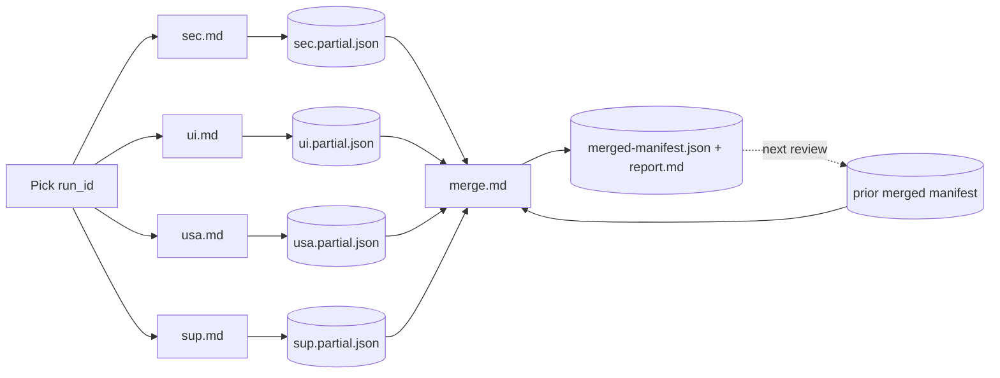

# Deep Review Harness — runner kit (v3, First Pitch)

Operational split of the canonical [DEEP_REVIEW_HARNESS.md](../DEEP_REVIEW_HARNESS.md) (v3) into
**paste-and-run** pieces, so a full deep review is one dimension per session keyed to a shared
`run_id`, then a single merge pass that computes the run-over-run diff and the unified report.

The canonical doc is the single source of truth for check semantics; these runners are its
mechanical split with First Pitch config pre-filled. This kit exists because a full v3 run
against First Pitch with Claude in Chrome is a long, multi-part session. Splitting it makes the
split *mechanical*: you never hand-assemble the harness, you paste one file per session.

## Stack reality (read this first)

The v3 prose uses a Supabase example. **First Pitch is not on Supabase.** The runners below
are pre-corrected for the real stack:

- Next.js 15 (App Router) on Vercel.
- Custom **magic-link auth** (`platform/packages/auth`, SHA-256 token hash, 15-min TTL,
  `platform_session` cookie) — not Supabase Auth.
- Storage = Vercel KV (`KvJsonStore`) | `JsonFileStore` | `InMemoryStore` — not Postgres.
- **Authorization is enforced in API route handlers** (`getSession` / `userCanManageTeam` /
  `requireRole`), **not** Postgres RLS. So the IDOR/over-fetch checks (`SEC-AUTHZ-002/003`,
  `SEC-API-001`) carry the load that RLS would carry in a Supabase app — they are the
  highest-value security checks here.
- The intentionally-public values are `NEXT_PUBLIC_*` env vars. Server-only secrets that must
  **never** appear in the client bundle: `PLATFORM_AUTH_SECRET`, `RESEND_API_KEY`,
  `KV_REST_API_URL`/`KV_REST_API_TOKEN`, `CRON_SECRET`, `STRIPE_SECRET_KEY`, `OPENAI_API_KEY`,
  `SENTRY_DSN`/`ERROR_WEBHOOK_URL`, `PRIVACY_INBOX` (`SEC-CLNT-001`).

## File map

| File | Role | Session |
|---|---|---|
| [runners/sec.md](runners/sec.md) | Security catalog (40 checks) | `dimension:sec` |
| [runners/ui.md](runners/ui.md) | Visual quality (12 checks) | `dimension:ui` |
| [runners/usa.md](runners/usa.md) | Usability + UX-A11Y + copy (24 checks) | `dimension:usa` |
| [runners/sup.md](runners/sup.md) | Supportability / shift-left (19 checks) | `dimension:sup` |
| [merge.md](merge.md) | Merge partial manifests → diff → unified report | final pass |

`ux` from the v3 mode enum is **folded into the USA runner** (the catalog block is
"Usability (measured) & UX-A11Y"). There is no standalone `ux` runner.

## Operating workflow

1. **Pick one `run_id` for the whole review** — convention `FP-QA-YYYYMMDD-NN` (increment `NN`
   for same-day reruns). Every dimension session and every fixture uses this exact id.
2. **Boot + warm the target** (local) — see the boot recipe below. Skip for a prod run.
3. **Run each dimension in its own fresh Claude-in-Chrome session.** Paste the whole runner
   file. Each session emits a **partial manifest** (only its dimension's `check_results`,
   `findings`, and one `dimension_scores` entry) plus a short P0/P1-first human summary.
   Save each partial as `platform/reports/deep-review/<run_id>.<dim>.partial.json`.
   - Order is free, but `sec` first is recommended: its authz/over-fetch results feed the
     severity coupling in `SEC-CLNT-001` and the privacy matrix.
4. **Run the merge pass once** — open a session, paste [merge.md](merge.md), then paste all
   partial manifests **and** the previous review's merged manifest (or `null` for a baseline).
   It produces the merged manifest + the run-over-run diff (NEW / REGRESSED / FIXED /
   PERSISTENT) + the unified human report in the v3 order.
5. **Persist the baseline** — save the merged manifest as
   `platform/reports/deep-review/<run_id>.merged-manifest.json` and the report as
   `platform/reports/deep-review/<run_id>.report.md`. The *next* review pastes that merged
   manifest as `previous_run_manifest`.



## Smoke mode (cheap reruns)

After a baseline exists, set `mode: smoke` in any runner. The session executes only the checks
that **failed in the pasted `previous_run_manifest`** plus every P0-capable check in that
dimension; everything else is recorded `not_applicable: smoke`. Use this to confirm fixes
without re-paying for a full sweep.

## Local boot recipe (Windows / PowerShell)

Run from `platform/`. Data dir must be **off OneDrive** (JsonFileStore atomic-rename `EPERM`).
Dev login is gated behind a flag the QA agents use.

```powershell
cd platform
$env:PLATFORM_DATA_DIR = "$env:TEMP\firstpitch-dev"
New-Item -ItemType Directory -Force -Path $env:PLATFORM_DATA_DIR | Out-Null
$env:PLATFORM_ALLOW_DEV_LOGIN = "1"
Remove-Item -Recurse -Force apps/web/.next -ErrorAction SilentlyContinue
cmd /c "npm run dev"
```

**Warm every route before reviewing.** A cold Next first-compile throws benign 401s/timeouts
that masquerade as `SEC-AUTH`/`SUP-REL` P0s. Loop until each returns 200:

```powershell
'/','/login','/coach','/parent','/missions','/drills','/safety','/fields','/gear','/policy' |
  ForEach-Object { Invoke-WebRequest "http://localhost:3000$_" -UseBasicParsing -TimeoutSec 90 | Out-Null }
```

> A localhost dev run cannot judge transport/header checks honestly (`SEC-TRAN-*`,
> `SEC-CLNT-002` source maps): HTTPS, HSTS, and prod CSP only exist on the deployed build.
> Run those against `https://firstpitch.app`. Functional/authz/UX/supportability checks are
> fine against localhost.

## Rules of engagement (apply in every session)

Verification, never exploitation. Use your `QA_{run_id}_` fixtures only. Stop at proof of
access — never read beyond proof, never modify tenant data you do not own. Reproduce twice or
label intermittent. Redact sensitive values to field names in the report. Surface any P0 in
security / privacy / minors-data / safety immediately at the top of the session output, then
continue. **When a spec doc disagrees with `DECISION-LOG.md`, the log wins.**
